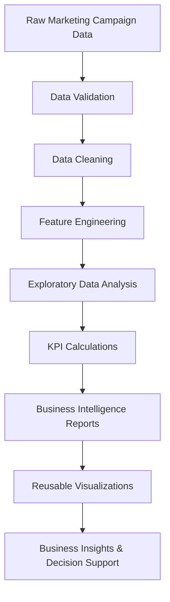

# 📊 Marketing Campaign Analytics


End-to-end Marketing Campaign Analytics solution that transforms raw campaign data into actionable Business Intelligence using Python, Exploratory Data Analysis (EDA), KPI reporting, and reusable visualization modules.

---

## 📑 Table of Contents

- [🚀 Project Overview](#-project-overview)
- [🎯 Business Problem](#-business-problem)
- [📊 Project Workflow](#-project-workflow)
- [🛠 Technology Stack](#-technology-stack)
- [📂 Project Structure](#-project-structure)
- [📈 Sample Visualizations](#-sample-visualizations)
- [💡 Key Insights](#-key-insights)
- [⚙️ Installation](#️-installation)
- [🚀 Future Improvements](#-future-improvements)
- [👨‍💻 About Me](#-about-me)

## 🚀 Project Overview

Marketing teams invest millions across multiple digital channels. This project analyzes campaign performance to identify trends, optimize marketing spend, and generate business insights through data-driven reporting.

The project covers the complete analytics workflow:

- Synthetic data generation
- Business rules implementation
- KPI calculation
- Channel & campaign performance analysis
- Customer segmentation
- Time-series analysis
- Executive Summary
- Reusable visualization utilities

---

## 🎯 Business Problem

Marketing teams invest significant budgets across multiple digital channels, campaigns, and customer segments. However, without structured analysis, it is difficult to identify which campaigns generate the highest engagement and deliver the best return on investment.

This project demonstrates an end-to-end analytics workflow that transforms raw marketing campaign data into actionable Business Intelligence using Python. The solution applies Exploratory Data Analysis (EDA), KPI reporting, and reusable visualization modules to evaluate campaign effectiveness, customer engagement, click-through rates (CTR), marketing spend, and conversion performance. The resulting insights support data-driven marketing decisions and campaign optimization.

---

## 📊 Project Workflow


The project follows a structured analytics workflow beginning with raw campaign data generation and validation. After cleaning and feature engineering, exploratory data analysis and KPI calculations are performed to evaluate campaign performance. The results are presented through reusable visualization modules, enabling business users to identify trends, optimize marketing spend, and support data-driven decision-making.

---

## 🎯 Business Objectives

- Analyze campaign effectiveness
- Measure marketing KPIs
- Identify best-performing campaigns
- Evaluate customer segments
- Compare marketing channels
- Analyze regional performance
- Understand device behaviour
- Track monthly and quarterly trends
- Generate executive-level insights

---

# 🛠 Technology Stack

| Category | Technologies |
|-----------|--------------|
| **Programming** | Python 3.14 |
| **Data Analysis** | Pandas, NumPy |
| **Visualization** | Matplotlib |
| **Development Tools** | VS Code, Jupyter Notebook |
| **Version Control** | Git, GitHub |
| **Data Storage** | CSV Files |
| **Project Architecture** | Modular Python Scripts |

The project uses a lightweight analytics stack focused on Python-based data analysis, visualization, and version-controlled development.

---

## 📂 Project Structure

```text
Marketing-Campaign-Analytics/
│
├── analysis/
├── dashboard/
├── data/
├── docs/
├── generator/
├── images/
├── notebooks/
├── outputs/
│   └── charts/
├── scripts/
├── sql/
├── utils/
│     └── visualization.py
│
├── README.md
├── requirements.txt
└── TODO.md
```

---

## 📈 Business KPIs

- Marketing Spend
- CTR (Click Through Rate)
- CPC (Cost Per Click)
- Clicks
- Impressions

---

## 📊 Analysis Modules

- Dataset Overview
- Campaign Analysis
- Channel Analysis
- Customer Segment Analysis
- Regional Analysis
- Device Analysis
- Time Series Analysis
- Executive Summary

---

## 📷 Sample Visualizations

> *(We'll add screenshots here once we organize the images folder.)*

- Channel Performance
- Monthly CTR Trend
- Campaign Distribution
- Spend vs CTR Scatter Plot

---

## 💡 Key Business Insights

- Email campaigns achieve the highest average CTR.
- Mobile generates the majority of clicks and impressions.
- Loyal customers demonstrate stronger engagement.
- Q4 records the highest marketing investment.
- Marketing spend alone does not directly increase CTR.

---

## 🚀 Future Enhancements

- Interactive Power BI Dashboard
- Streamlit Dashboard
- Machine Learning Campaign Prediction
- Marketing ROI Analysis
- Customer Lifetime Value Analysis

---

## ⚙️ Installation

```bash
git clone https://github.com/TusharJadhav-ai/marketing-campaign-analytics.git

cd marketing-campaign-analytics

pip install -r requirements.txt
```

---

## 👨‍💻 Author

**Tushar Jadhav**

Senior Data Analyst | Python | SQL | Power BI | Business Intelligence