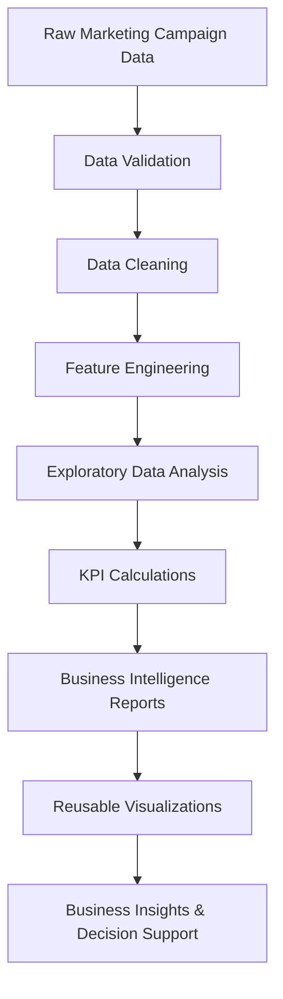
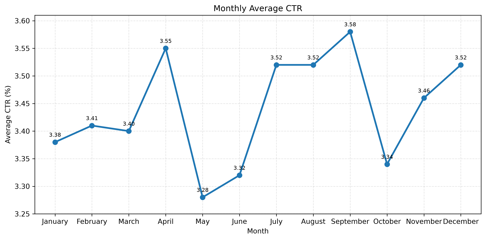
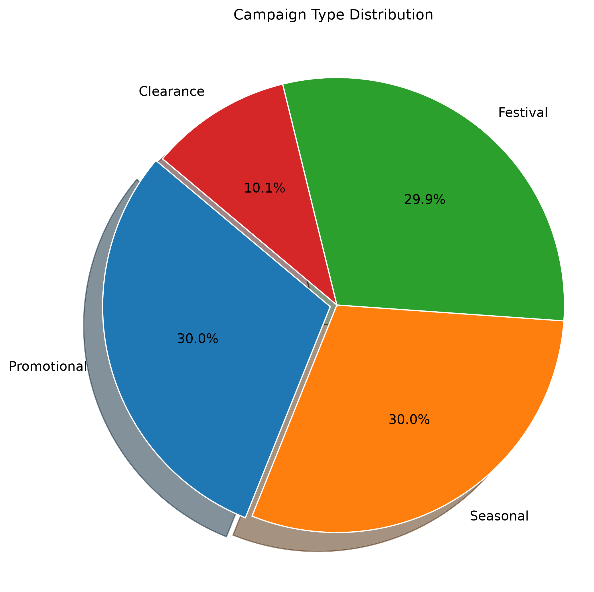
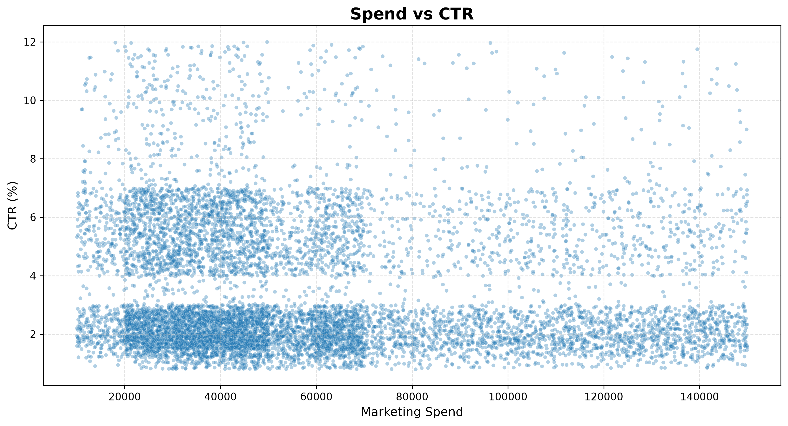
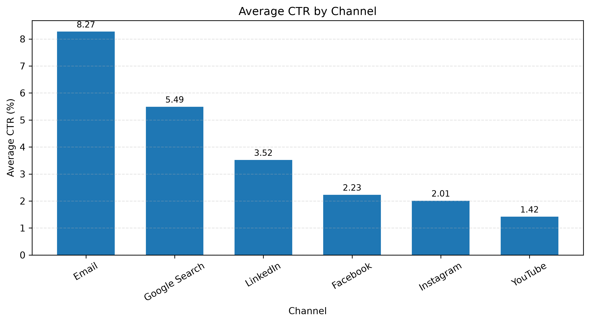

# 📊 Marketing Campaign Analytics


End-to-end Marketing Campaign Analytics solution that transforms raw campaign data into actionable Business Intelligence using Python, Exploratory Data Analysis (EDA), KPI reporting, and reusable visualization modules.

---

## 📑 Table of Contents

- [🚀 Project Overview](#-project-overview)
- [🎯 Business Problem](#-business-problem)
- [📊 Project Workflow](#-project-workflow)
- [🛠 Technology Stack](#-technology-stack)
- [📂 Project Structure](#-project-structure)
- [📈 Sample Visualizations](#-sample-visualizations)
- [💡 Key Insights](#-key-insights)
- [⚙️ Installation](#️-installation)
- [🚀 Future Improvements](#-future-improvements)
- [👨‍💻 About Me](#-about-me)

## 🚀 Project Overview

Marketing teams invest millions across multiple digital channels. This project analyzes campaign performance to identify trends, optimize marketing spend, and generate business insights through data-driven reporting.

The project covers the complete analytics workflow:

- Synthetic data generation
- Business rules implementation
- KPI calculation
- Channel & campaign performance analysis
- Customer segmentation
- Time-series analysis
- Executive Summary
- Reusable visualization utilities

---

## 🎯 Business Problem

Marketing teams invest significant budgets across multiple digital channels, campaigns, and customer segments. However, without structured analysis, it is difficult to identify which campaigns generate the highest engagement and deliver the best return on investment.

This project demonstrates an end-to-end analytics workflow that transforms raw marketing campaign data into actionable Business Intelligence using Python. The solution applies Exploratory Data Analysis (EDA), KPI reporting, and reusable visualization modules to evaluate campaign effectiveness, customer engagement, click-through rates (CTR), marketing spend, and conversion performance. The resulting insights support data-driven marketing decisions and campaign optimization.

---

## 📊 Project Workflow


The project follows a structured analytics workflow beginning with raw campaign data generation and validation. After cleaning and feature engineering, exploratory data analysis and KPI calculations are performed to evaluate campaign performance. The results are presented through reusable visualization modules, enabling business users to identify trends, optimize marketing spend, and support data-driven decision-making.

---

## 🎯 Business Objectives

- Analyze campaign effectiveness
- Measure marketing KPIs
- Identify best-performing campaigns
- Evaluate customer segments
- Compare marketing channels
- Analyze regional performance
- Understand device behaviour
- Track monthly and quarterly trends
- Generate executive-level insights

---

# 🛠 Technology Stack

| Category | Technologies |
|-----------|--------------|
| **Programming** | Python 3.14 |
| **Data Analysis** | Pandas, NumPy |
| **Visualization** | Matplotlib |
| **Development Tools** | VS Code, Jupyter Notebook |
| **Version Control** | Git, GitHub |
| **Data Storage** | CSV Files |
| **Project Architecture** | Modular Python Scripts |

The project uses a lightweight analytics stack focused on Python-based data analysis, visualization, and version-controlled development.

---

# 📁 Project Structure

```text
marketing-campaign-analytics/
│
├── analysis/              # Business analysis modules
├── dashboard/             # Dashboard files
├── data/                  # Raw and generated datasets
├── docs/                  # Project documentation
├── generator/             # Synthetic data generation
├── images/                # README images and visualizations
├── notebooks/             # Jupyter notebooks
├── outputs/               # Exported reports and charts
├── scripts/               # Validation and helper scripts
├── sql/                   # SQL queries
├── utils/                 # Reusable visualization utilities
│
├── README.md
├── requirements.txt
└── .gitignore
```

### Folder Description

| Folder | Purpose |
|---------|---------|
| **analysis/** | Business Intelligence analysis modules including KPI calculations, EDA, channel analysis, campaign analysis, and executive reporting. |
| **dashboard/** | Dashboard components and future interactive reporting. |
| **data/** | Generated marketing campaign datasets used throughout the project. |
| **docs/** | Project documentation and supporting reference material. |
| **generator/** | Synthetic data generation engine with configurable business rules. |
| **images/** | Visualization images displayed inside the README. |
| **notebooks/** | Interactive exploratory analysis using Jupyter Notebook. |
| **outputs/** | Generated charts, reports, and exported analysis. |
| **scripts/** | Data validation and automation scripts. |
| **sql/** | SQL practice queries for campaign analytics. |
| **utils/** | Reusable visualization utilities and plotting functions. |

This project follows a modular architecture where data generation, business analysis, visualization, reporting, and reusable utilities are organized into independent components for better scalability and maintainability.

---

## 📈 Business KPIs

- Marketing Spend
- CTR (Click Through Rate)
- CPC (Cost Per Click)
- Clicks
- Impressions

---

## 📊 Analysis Modules

- Dataset Overview
- Campaign Analysis
- Channel Analysis
- Customer Segment Analysis
- Regional Analysis
- Device Analysis
- Time Series Analysis
- Executive Summary

---

# 📈 Sample Visualizations

The project includes reusable visualization modules to support exploratory analysis and Business Intelligence reporting. Below are a few sample outputs generated from the synthetic marketing campaign dataset.

---

## 1️⃣ Monthly Average CTR Trend



**Business Insight**

- Monthly CTR remained relatively stable between **3.3% and 3.6%**.
- September recorded the highest average CTR, indicating stronger campaign engagement.
- May showed the lowest CTR, highlighting a potential opportunity for campaign optimization.

---

## 2️⃣ Campaign Type Distribution



**Business Insight**

- Promotional, Seasonal, and Festival campaigns contribute almost equally to the marketing mix.
- Clearance campaigns represent a much smaller share of total campaigns.
- A balanced campaign portfolio enables consistent customer engagement throughout the year.

---

## 3️⃣ Marketing Spend vs CTR



**Business Insight**

- Higher marketing spend does not always result in higher CTR.
- The scatter plot suggests that campaign quality and targeting may have a stronger influence on engagement than budget alone.
- This visualization helps identify opportunities to optimize marketing ROI.

---

## 4️⃣ Average CTR by Channel



**Business Insight**

- Marketing channels exhibit varying levels of customer engagement.
- Comparing average CTR across channels helps prioritize investment toward higher-performing platforms.
- Channel-level KPIs support more informed budget allocation decisions.

---

# 💡 Key Business Insights

- 📈 **Campaign performance remained consistent**, with average monthly CTR ranging between **3.3% and 3.6%**, indicating stable customer engagement throughout the year.

- 🎯 **Marketing spend alone does not guarantee higher engagement.** The analysis suggests that campaign targeting and content quality have a greater impact on CTR than budget size.

- 📊 **Campaign types are well balanced**, with Promotional, Seasonal, and Festival campaigns each contributing approximately **30%** of the total marketing mix.

- 📣 **Channel-level performance analysis** enables marketers to identify the highest-performing platforms and optimize budget allocation.

- 📉 **Monthly trend analysis** helps identify seasonal performance variations and supports better campaign planning.

- 🚀 **Reusable analytics modules** allow the same workflow to be applied to new datasets with minimal code changes, improving scalability and maintainability.

- 🚀 **Built using a modular and reusable architecture** enabling the analytics workflow to be extended to new marketing datasets with minimal code changes.

---

## 🚀 Future Enhancements

- Interactive Power BI Dashboard
- Streamlit Dashboard
- Machine Learning Campaign Prediction
- Marketing ROI Analysis
- Customer Lifetime Value Analysis

---

## ⚙️ Installation

```bash
git clone https://github.com/TusharJadhav-ai/marketing-campaign-analytics.git

cd marketing-campaign-analytics

pip install -r requirements.txt
```

---

## 👨‍💻 Author

**Tushar Jadhav**

Senior Data Analyst | Python | SQL | Power BI | Business Intelligence